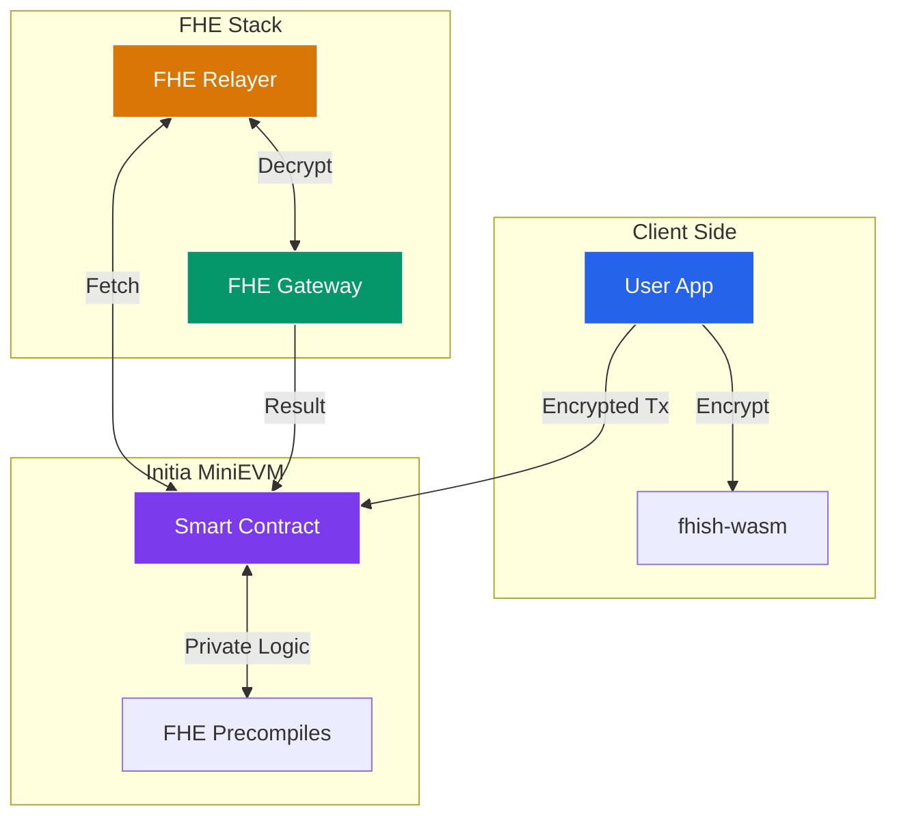

The **Fhish Documentation** is the primary source of technical and user-facing information for the Fhish ecosystem.

## 🏗️ System Architecture



## 🚀 Quick Start with v0.1.8

The documentation site now includes the latest **v0.1.8** "Wizard Way" setup guide. 

### Key CLI Workflows:
- **`fhish create all`**: The new interactive entry point for full stack provisioning.
- **`fhish docker verify`**: The standard way to validate FHE protocol health.
- **`fhish version`**: Ensure you are on the latest release for the hackathon.

---

## 🚀 Local Development

### Installation
```bash
npm install
```

### Development
```bash
npm run dev
```
Open [http://localhost:3000](http://localhost:3000) to view the documentation portal.

---

## 📁 Directory Structure
- `contents/`: All MDX documentation files.
- `app/`: Next.js page structure for the documentation site.
- `components/`: UI components for the documentation interface.

## 🌍 Contributing
To update the documentation, modify the markdown files in the `contents/` directory.
