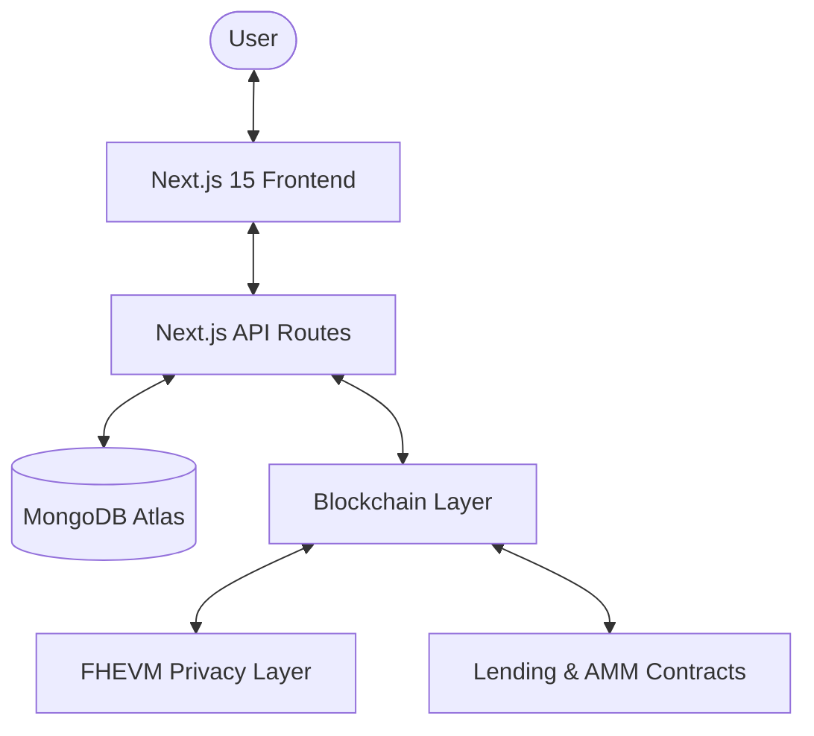

## Full Stack Overview

Fhish is built with a modular architecture that integrates blockchain privacy, efficient data management, and user-friendly frontends.

### Components

1.  **Frontend Layer**: Next.js 15 (React 19) applications for shoppers, merchants, and the core protocol.
2.  **API Layer**: Serverless functions handling data orchestration and proof verification.
3.  **Database Layer**: MongoDB Atlas for tracking user positions, protocol stats, and merchant configurations.
4.  **Blockchain Layer**: Ethereum-compatible network (Sepolia/Local) hosting the core protocol.
5.  **Privacy Layer**: Zama's FHEVM for encrypted lending and borrowing operations.

### Data Flow

#### AMM Swap Flow
1.  **Frontend**: User enters amount, calls `getAmountOut()`.
2.  **Blockchain**: User approves tokens and executes `swap()`.
3.  **UI**: Updates with new balances after transaction confirmation.

#### Lending Pool Flow
1.  **Frontend**: User deposits collateral.
2.  **Smart Contract**: Transfers assets and mints LP tokens.
3.  **API Route**: Updates MongoDB with the new user position.
